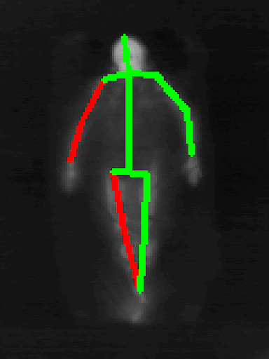

# IEEE VIP Cup 2021 - SLP Human Pose Estimation - (Winning Solution by Team Samaritan )


[IEEE Video and Image Processing Cup 2021](https://signalprocessingsociety.org/community-involvement/video-image-processing-cup) is a deep learning based Computer Vision competition organized by [IEEE](https://www.ieee.org/). In this edition, the challenge was to estimate sleeping pose of different subjects, often covered by thin or thick sheets, by using only LWIR(Long Wavelength Infra-Red) images. Among several participents top three were selected for the final round (to be) organized at Alaske, USA. 

Team Samaritan was announced winner of the challange , by testing the the model of the finalists on a different dataset and was awarded certificate as well as a grand prize money of USD $5000.

### Team Samaritan :
- Sanjay Acharjee [Github](https://github.com/sawradip) [Kaggle](https://www.kaggle.com/sawradipsaha)
- Shahriar Kabir Nahin [Github](https://github.com/sawradip) [Kaggle](https://www.kaggle.com/sawradipsaha)
- Sawradip  Saha [Github](https://github.com/sawradip) [Kaggle](https://www.kaggle.com/sawradipsaha)
- Aurick Das [Github](https://github.com/sawradip) [Kaggle](https://www.kaggle.com/sawradipsaha)
- Shahrukh Hossain(Mentor) [Github](https://github.com/sawradip) [Kaggle](https://www.kaggle.com/sawradipsaha)
- Professor Md. Ariful Haque(Supervisor) [Github](https://github.com/sawradip) [Kaggle](https://www.kaggle.com/sawradipsaha)


## Introduction
Repository containing training scripts and data for IEEE VIP Cup 2021 - SLP Human Pose Estimation.

## Notes
* Our provided training checkpoints are generated with Pytorch Lightning, thus have a large file size (about 800 MB). But only the model weights are much smaller (about 200 MB).
* The AUC metric we used isn't identical to the one used in Codalab thus the training time AUC in terminal might differ.
## Quick start


1. Install all the requirements from `requirements.txt`
```
pip install -r requirements.txt
```

2. Lets consider the root folder to be `vip-cup-2021`. Change the directory to the root folder.
```
cd './vip-cup=2021'
```

3. Download and place the training data at appropriate folder.
```
vip-cup-2021
    ├── data
        ├── train
        |   ├── train
        |       ├── 00001
        |           ├── IR
        |           ├── RGB
        |           ├── joints_gt_IR.mat
        |           ├── joints_gt_RGB.mat
        ├── valid
        |   ├── valid
        |       ├── 00081
        |           ├── IR
        |           ├── RGB
        |           ├── joints_gt_IR.mat
        |           ├── joints_gt_RGB.mat
        ├── test1
        |   ├── 00001
        |       ├── IR

```


## Training

### Phase 1 training

1. Download the `MPII Pretrained` weight from [here](https://drive.google.com/file/d/1mrgLvqOunAGkUg9LR9SX573Wu1oNo6If), and place in the appropriate folder.

```
vip-cup-2021
    ├── weights
        ├── mpii_pretrained
            ├── pose_resnet_101_384x384.pth.tar
```

2. Run `train.py` with apropriate arguments.
```
python train.py --phase 1
```
3. After Phase 1 , training weights will be saved on `vip-cup-2021/weights/p1_weights` folder.

### Phase 2 training

4. Run `t_annotate.py` with appropriate parameters( phase 1 training checkpoint path ) 
```
python t_annotate.py --checkpoint weights/p1_weights/last.ckpt 
```

5. This will generate annotations for all unannotated images, which will be used in phase 2 training. The annotations will  be saved at `vip-cup-2021/results/prediciton_unannotated.pkl`

6. Run `train.py` with apropriate arguments( phase 2 training checkpoint path ).
```
python train.py --phase 2 
```
7. The final (5 best) weights will be saved at `vip-cup-2021/weights/p2_weights` folder.
## Inference

1. If our trained weights is to be used, download it from [here](https://drive.google.com/drive/folders/17BhMFtfCdb1KChhfRlcfDmkVf1OhvoJu). Otherwise use weights saved in `vip-cup-2021/weights` folder.  We used the best 2 weights (on AUC) to get the test set 1 (leaderboard score) result.


2. Run `test.py` with apropriate arguments for ensemble( with 2 training checkpoint paths from google drive or training).
```
python test.py --checkpoint weights\p2_weights\epoch=34-valid_auc=0.1609-valid_acc=78.0772-train_loss=0.0001-train_acc=98.2946.ckpt weights\p2_weights\epoch=70-valid_auc=0.1610-valid_acc=78.6830-train_loss=0.0000-train_acc=99.7143.ckpt
```

3. After the inference is done, `preds.json` will be generated in `vip-cup-2021/results` folder.


### Predicitons from the trained model:


